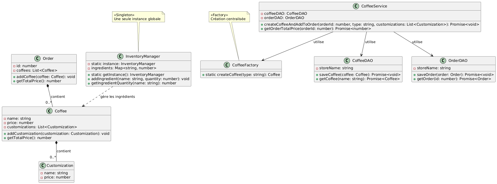

# ☕ CoffeeManagement

CoffeeManagement est une application web conçue pour gérer et personnaliser différents types de cafés. Elle utilise **TypeScript** et **IndexedDB** pour une gestion efficace des données côté client, avec une architecture modulaire et évolutive.

---

## 📌 Sommaire

- [🧾 Description du projet](#-description-du-projet)
- [🚀 Fonctionnalités](#-fonctionnalités)
- [🏗️ Architecture du projet](#️-architecture-du-projet)
- [🛠️ Technologies utilisées](#️-technologies-utilisées)
- [📦 Installation & Configuration](#-installation--configuration)
- [💡 Exemple d'utilisation](#-exemple-dutilisation)
- [📈 Améliorations futures](#-améliorations-futures)
- [👩‍💻 Auteur](#-auteur)

---

## 🧾 Description du projet

CoffeeManagement est une application de gestion de cafés permettant de :

- Créer des cafés personnalisés avec des options comme le sucre, le lait, la crème, etc.
- Enregistrer ces cafés dans une base de données locale (IndexedDB)
- Gérer la liste des commandes et affichages dynamiques (à venir)

---

## 🚀 Fonctionnalités

- ✅ Création de cafés standards (Espresso, Cappuccino, etc.)
- ✅ Ajout d'options personnalisées (ex. : sucre, crème, etc.)
- ✅ Stockage des données dans le navigateur avec IndexedDB
- 🔄 Affichage des cafés sauvegardés
- 📊 (À venir) Gestion des statistiques et commandes

---

## 🏗️ Architecture du projet
CoffeeManagement/
│
├── models/ # Modèles de données (Coffee, Customization)
├── dao/ # Accès aux données (IndexedDB)
├── services/ # Logique métier
├── factory/ # Génération automatique de types de café
├── utils/ # Fonctions utilitaires
└── main.ts # Point d'entrée principal


## 📌 Diagramme visuel de l'architecture :




---

## 🛠️ Technologies utilisées

- **TypeScript** - Typage statique et POO
- **IndexedDB** - Base de données locale côté client
- **Modular Architecture** - Séparation claire des responsabilités

---

##  📦 Installation & Configuration

### Prérequis
- Node.js (version 14+ recommandée)
- npm (généralement inclus avec Node.js)
- TypeScript (installé globalement ou en dépendance)

### 1. Cloner le dépôt

```bash
git clone https://github.com/aminamahrour/CoffeeManagement.git
cd CoffeeManagement
```
2. Installer les dépendances
```bash
npm install
# ou si vous utilisez yarn
yarn
```
3. Configuration TypeScript
Le projet inclut déjà un tsconfig.json. Pour vérifier la configuration :


```bash
npx tsc --showConfig
```
4. Exécuter en mode développement
```bash
npm run dev
# ou pour une compilation en temps réel
npx tsc --watch
```
5. Lancer le serveur
Selon votre configuration (vérifiez le package.json) :

Avec Vite (recommandé) :

```bash
npm run dev
Avec webpack :


npm start
```
Avec un serveur simple :

```bash
npx serve -s
```
6. Build de production
```bash
npm run build
# Génère les fichiers JS dans /dist
```
🛠 Structure TypeScript

src/
├── models/         # Définitions d'interfaces et classes
│   └── Coffee.ts
├── types/          # Fichiers de déclaration
│   └── custom.d.ts
├── utils/          # Helpers TypeScript
│   └── helpers.ts
└── main.ts         # Point d'entrée principal
🔧 Résolution de problèmes TypeScript
Si vous rencontrez des erreurs de compilation :

```bash
# Vérifier les erreurs de type
npx tsc --noEmit

# Mettre à jour les types manquants
npm install @types/node --save-dev

# Réinitialiser le cache TypeScript
npx tsc --build --clean
```
Pour une meilleure expérience IDE :

Ouvrir le projet dans VS Code

Installer l'extension TypeScript Importer

Activer le mode strict dans tsconfig.json :

```bash
{
  "compilerOptions": {
    "strict": true
  }
}
```
## 💡 Exemple d'utilisation

// Création d'un cappuccino avec crème
const cappuccino = coffeeFactory.createCoffee("Cappuccino");
cappuccino.addCustomization(new Customization("Crème", 0.4));
await coffeeDAO.save(cappuccino);

## 📈 Améliorations futures
Interface graphique HTML/CSS/JS

Système de commande complet

Authentification utilisateur

Export PDF ou Excel des commandes

## 👩‍💻 Auteur
Amina Mahrour
Asmae Erragragy

